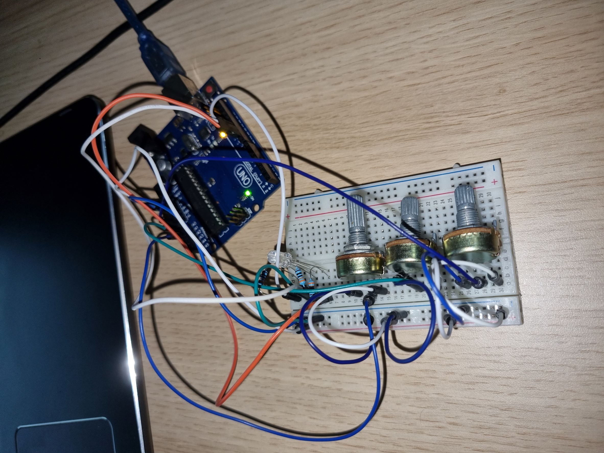
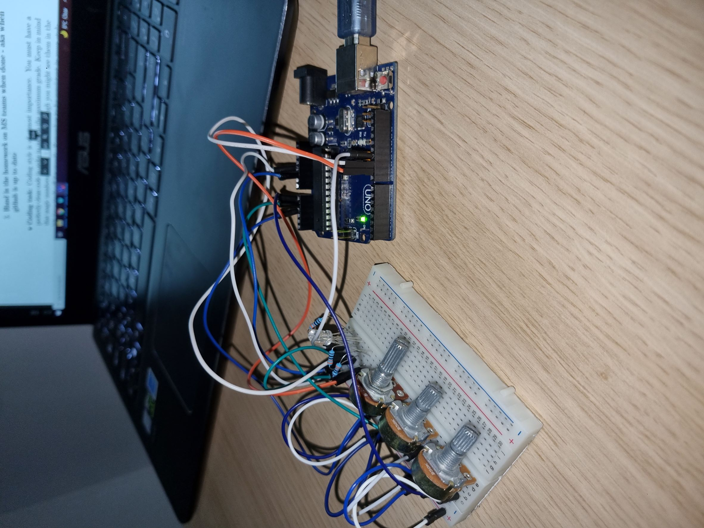
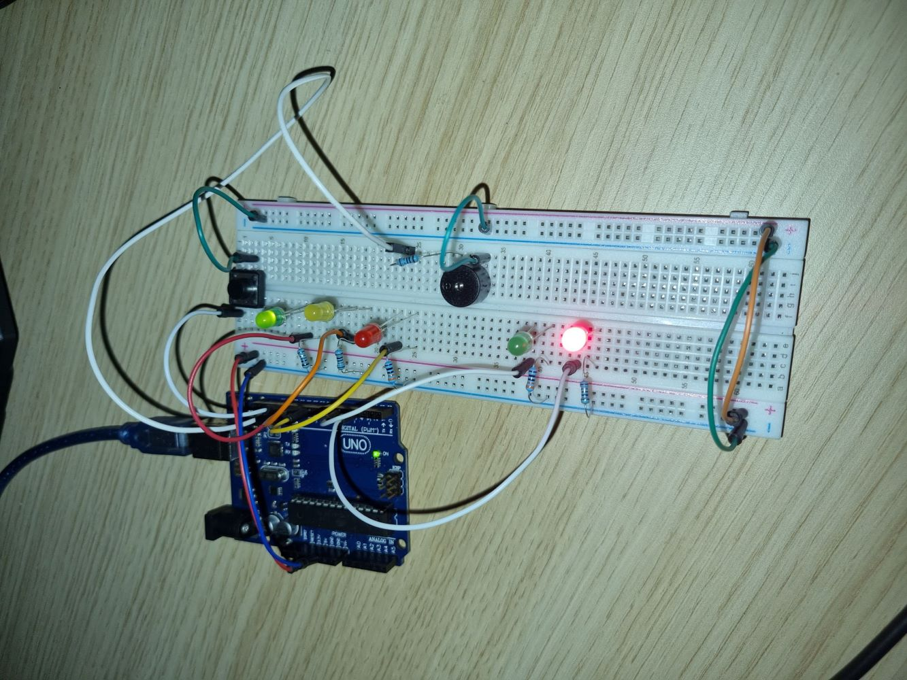
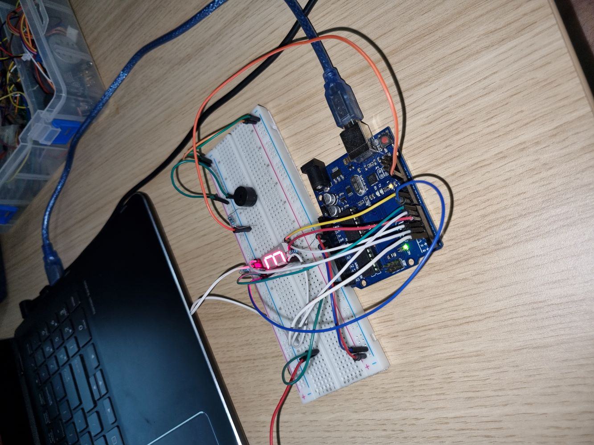

# Introduction To Robotics (2021 - 2022)

Introduction to Robotics laboratory homeworks, taken in the 3rd year at the Faculty of Mathematics and Computer Science, University of Bucharest. We will discuss and learn about robotics using Arduino Uno. 

# Homework 1 - Light up a RGB led

## Components

* RGB led
* wires and 3 resistors
* 3 potentiometers

## Task

Use a separate potentiometer in controlling each of the color of the RGB led (Red,Green and Blue).  The control must be done with digital electronics(you must read the value of the potentiometer with Arduino, and write a mapped value to each of the pins connected to the led).

## Setup Pictures

## Youtube Demo

https://www.youtube.com/watch?v=BxD2xCbVAZc

# Homework 2 - Traffic Lights

## Components

* 5 LEDs
* 1 button
* 1 buzzer
* wires and 3 resistors

## Task

Building the traffic lights for a crosswalk. You will use 2 LEDs to represent the traffic lights for people (red and green) and 3 LEDs to represent the traffic lights for cars (red, yellow and green). See the states it needs to go through. The system has the following states:

1. State 1 (default, reinstated after state 4 ends): green light for cars, red light for people, no sounds. Duration: indefinite, changed bypressing the button.
2. State 2 (initiated by counting down 10 seconds after a button press): the light should be yellow for cars, red for people and no sounds. Duration: 3 seconds.
3. State 3 (iniated after state 2 ends): red for cars, green for people and a beeping sound from the buzzer at a constant interval. Duration: 10 seconds.
4. State 4 (initiated after state 3 ends): red for cars, blinking green for people and a beeping sound from the buzzer, at a constant interval, faster than the beeping in state 3.

## Setup Pictures

## Youtube Demo

https://www.youtube.com/watch?v=YbOIRNmDqcI

# Homework 3 - EMF Detector

## Components

* 7-segment display
* 1 buzzer
* wires and resitors

## Task

Should detect EMF (check body and near outlets). It should print the value on the 7-segment display and should make a sound based on the intensity.

## Setup Pictures

## Youtube Demo

https://www.youtube.com/watch?v=06nDbn-i898
